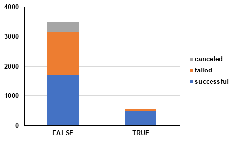
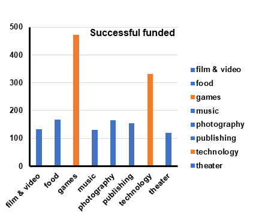
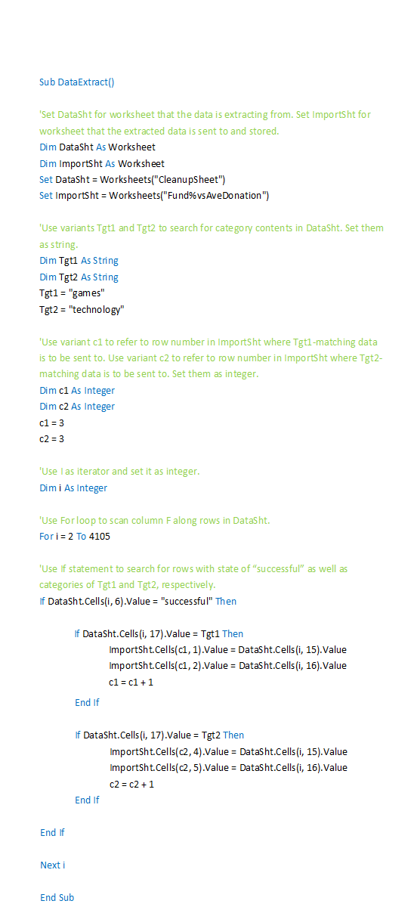
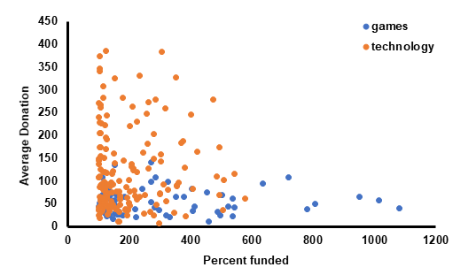

# Kickstarter
<h2>Questions addressed by analyzing the Kickstarter data were:</h2>

<strong>1.	What are three conclusions we can make about Kickstarter campaigns given the provided data?</strong>

(1). Among over 4000 projects being analyzed (total 4114), 74% were launched in the US and 15% were from the Great Britain. They accounted for nine tenth of all campaigns taking place in Kickstarter. As to the successful rate, roughly half projects met their goals whereas 37% failed in the campaigns and another 8% confronted a cancelation.

(2). The most popular campaign category is “theater” (34%), followed by “music” (17%), “technology” (15%), and “film & video” (13%). Interestingly, 3 out of 4 of the most popular categories went beyond the aforementioned total successful rate (53%). They were “music” (77%), “theater” (60%), and “film & video” (58%). Only 35% of “technology” were found successful. “rock” accounted for nearly half (48%) of all music types being launched. Surprisingly, all “rock” music fulfilled their goals. Small in total amounts though, “classical”, “electronic”, “pop”, and “metal” music also exhibited a 100% successful rate. They all contributed to the highest successful rate (77%) that “music” category scored.

(3). The projects in our sample pool were evenly launched across the year except in December, when a 30% decline was seen. Monthly counts for cancelation was pretty small and flat whereas those representing success and failure fluctuated. The fluctuation, however, followed a trend that both curves largely echoed each other except in February and June where counts went oppositely between success and failure. Overall, the first half of a year seems to be a better time for creators to launch their project.

<strong>2.	What are some of the limitations of this dataset?</strong>

Despite the conclusions stated above, this dataset has its limitations, which will be discussed below from two major aspects.

<ul><i>A.	Data cleanliness</i>

<li>In real circumstances, backers might only spend a tiny amount of money (e.g. $1) on project just to follow up updates and to gain insights and experiences on how to execute a fund-raising campaign. In this scenario, backer’s counts were arbitrarily increased, which might disturb the accuracy of data analysis. Therefore, such nonsense backing hits should be cleaned up before performing the analysis. (Note: To publicly get the amount of pledge a backer is made to a specific project is logically feasible but against the Kickstarter’s policy. I am not sure if such data is legally available.)</li>

<li>Successful pledges for projects set with small goals might interfere. Two extreme situations are when the goals are fulfilled with either few or excessive backer counts.  If pledged by few counts, the backer’s personal preferences might weigh too much that could have introduced bias. Examples are id #31, 847, and 2213. On the other hand, an abnormal high volume of backers’ counts would render the “percent funded” of this project soaring to the sky. Examples are id #1253, 2243 and 2734. Therefore, projects with small goals (<25) should be excluded.</li></ul>

<ul><i>B.	More detailed info. from both the creators’ and backers’ sides</i>

<li>The successful pledging rate of a creator is an unneglectable factor that undoubtedly impacts on the backers’ choices. There should be column for it in the original worksheet. Moreover, backers’ confidences in the goal the creator is pledging is supposed to be changed under given successful rates. It will be fun to see if there is a correlation between a creator’s successful rates and the amount s/he is pledging.</li>

<li>Also, how a creator managed his/her Kickstarter webpage need to be graded and quantified. Info. falling into this category is but not limited to how intuitive the photos and/or videos are; whether the creator provides links (URLs) of his/her social media accounts; how often the creator updates with his/her backers; and whether there are milestone bonuses and stretch goal rewards, etc.</li>

<li>There is really not much info. that can be collected from the backer side. But a retreat on backer’s counts (fund withdrawal) might potentially influent the confidence of the other backers over the specific project. Therefore, backer’s withdrawal info. could be taken into consideration.</li>

<li>It is easy to buy that backing for other projects, to some extent, could reflect the creator’s understanding and judgement over a successful campaign, which in turn gives backers some clues on whether the creator is worthy counting on. As a result, it is necessary to have the creator’s backing counts as well as his/her successful backing rates in the original working sheet.</li></ul>

<strong>3.	What are some other possible tables/graphs that we could create?</strong>

What if, you as a potential backer, do not want to kill too many of your neural cells and waste too much time dwelling on Kickstarter.com but still want to make some profits? Here is a feasible solution: Go searching for “Projects We Love” (Staff Pick). The rationale for this is that if you make a new pivot table (StaffPick) based on the OriginalSheet and set “state” in columns, “staff_pick” in rows, and look for “count of state” in values, you will find in the stacking column that “staff_pick” projects account for almost 90% successful state as compared to that from non-staff_pick projects, where only about half are successful.

So far so good but you still need more tips? Let’s see if we can do something more. As I mentioned above, projects with really small goals might disturb the analysis. So, I made a copy of the OriginalSheet and excluded 10 projects with goals set below 20. I name the new one CleanupSheet. You’ve followed me this far, I guess you are conservative over investment and want your money to be spent as safe as possible, right? Let’s only focus on projects that ended up with high percent funded (of course they were over 100%). I generated another pivot table (Fund%) based on CleanupSheet with state in columns and category in rows and looking for average of percent funded. After setting the filter in column labels by only showing successful, we realized that the categories of games and technology scored the highest.

All right! Now we narrowed down to only two categories. Games? Or technology? They both can secure us in the safest position with staff_pick projects. So, which one to choose? For me, I will choose the one that costs less. Let’s make a deeper analysis over the two populations. With the following VBA codes, I was able to extract successful games and technology projects and store them to a new worksheet named Fund%vsAveDonation.

Now we got 79 games and 208 technology scores stored in A3:B81 and D3:E212 of Fund%vsAveDonation. Then I used Excel Quartile function to get rid of the outliers within the two datasets. Outliers showing up in either percent funded or average donation excluded the specific project. Volume of the two datasets were further shrunk to 64 for games and 169 for technology after outliers were removed. To determine if there is significant difference between games and technology under category of either percent funded or average donation, F-test was performed to ensure that the variances were unequal between games and technology no matter what category was calculated. Two-sample unequal variance t-test was performed accordingly. Let me tell you the truth: game scored significantly higher in percent funded and smaller in average donation over technology. Now you know which category to choose from, right?

